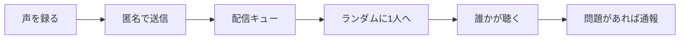

# 「その声、誰かに届け」— プロダクト意見とMVP方針

## 総評：アイデアの魅力

**「匿名 × 音声 × 知らない誰か × 一方通行」** という組み合わせは、市場で差別化しやすいです。

- **テキスト匿名アプリ**（Whisper 等）より、声は感情・間・トーンが伝わり、「人の温度」を感じやすい
- **チャット型匿名アプリ**（Omegle 系）より、会話が続かない設計の方が**荒らし・ハラスメント・依存**を抑えやすい
- **手紙・ボトルメール型**は「届ける」という行為自体が目的になり、返信を待つストレスがない
- 日本語のタイトル「その声、誰かに届け」は、SNS的な自己演出ではなく**献身的・詩的**なトーンで、ブランドとして強い

一言で言うと、**「デジタル時代のボトルメール」** として十分に成立するアイデアです。

---

## 選んだ方向性が良い理由

| 選択 | 効果 |
|------|------|
| 一方通行 | 返信設計・既読・会話管理が不要。モデレーション範囲が「1本の音声」に限定される |
| 完全ランダム | 「誰に届くか分からない」神秘性が体験の核になる。マッチングUIもシンプルにできる |

この2つは**初めて作る個人/小規模チーム向け**として、最も現実的な組み合わせです。

---

## 体験の核心（ここを最初から固定する）

ユーザーが感じるべき感情：

1. **送る側** — 「誰かの夜に、少し届くかもしれない」
2. **受け取る側** — 「知らない誰かから、理由もなく届いた声」

UIコピーもこの2つの感情に寄せると、アプリの個性が出ます。

---

## 最大のリスク：音声UGCの運営

匿名音声は**価値とリスクが同じくらい大きい**ジャンルです。ここを軽視すると App Store 審査・炎上・法的問題のいずれかで止まりやすいです。

**想定される問題**
- 暴言、脅迫、差別
- 性的コンテンツ
- 個人が特定できる情報（名前・住所・SNS ID）の読み上げ
- 自傷・他害に関する内容

**MVP段階から入れるべき対策**
- 録音時間の上限（例：**30〜60秒**）
- 1日の送信回数上限（例：**3回**）
- **通報ボタン**（必須）
- 利用規約・コミュニティガイドライン（何を禁止するか明文化）
- 可能なら **音声→テキスト変換 → NGワード検知**（送受信前の自動フィルタ）
- 問題音声の**即時削除**と送信者の**デバイス/アカウント単位のBAN**

> 音声はテキストより自動モデレーションが難しいため、「会話をさせない」「短い」「回数制限」「通報」を**プロダクト設計そのもの**に組み込むのが正解です。

---

## 差別化のアイデア（MVP後でも可）

必須ではないが、世界観を強くできる要素：

- **届け先は1人だけ** — 「今日、あなたの声は1人に届きました」と表示
- **返信は不可** — 代わりに「届いた」という軽い通知だけ（任意・匿名）
- **テーマは後から** — 初版はランダムのみで十分。v2 で「励ましてほしい / 話を聴いてほしい」等
- **再生は1回限り** — 緊張感とプライバシー（実装・UXは要検討）
- **季節・時間帯の演出** — 夜に届く、雨の日のUI など情緒的なブランディング

---

## 技術・プロダクト上の論点

### コールドスタート問題
最初はユーザーが少なく、「送っても誰も聴かない / 受け取れない」状態になります。

**対策案**
- 初期は**プール型に近い運用**（裏側でキューを貯める）
- ベータ期間中は**運営が種となる音声を入れる**（利用規約に明記）
- 「今日届いた声：0件」より「届くまで待つ」など、**期待値の設計**

### プライバシー
- 声紋は生体情報に近い → **プロフィール不要・顔不要**を徹底
- 録音データの**保存期間**（例：配信後7日で削除）を決める
- Apple の [App Privacy Details](https://developer.apple.com/app-store/app-privacy-details/) に正確に記載

### 既存プロジェクトとの関係
現在の [VoiceSubmit](VoiceSubmit/) は SwiftUI の TabView 骨組み（[ContentView.swift](VoiceSubmit/ContentView.swift)、[HomeView.swift](VoiceSubmit/Views/HomeView.swift)）のみ。これから**録音・再生・送信・受信**の4機能が本体になります。

---

## MVP（最初の1版）の推奨スコープ

**やること**
- ホーム：「声を届ける」「声を聴く」の2アクション
- 録音（上限付き）→ 確認 → 送信
- ランダムに1件受信 → 再生
- 通報
- 設定：利用規約、プライバシーポリシー、通報の説明

**最初はやらないこと**
- 返信・チャット
- プロフィール・フォロー
- リアルタイムマッチング
- 高度なレコメンド

**バックエンド候補**（実装時に選定）
- [Firebase](https://firebase.google.com/)（Storage + Firestore + Cloud Functions）— 個人開発で早い
- [Supabase](https://supabase.com/) — PostgreSQL + Storage、RLS で匿名設計しやすい

---

## 成功の指標（リリース前に決めておく）

数値より**体験の質**を見る段階：

- 送信完了率（録音開始 → 送信まで）
- 受信後の再生完了率
- 通報率（低すぎも高すぎも要注意）
- 7日後リテンション

「週1回、誰かの声を聴き、時々自分の声を届ける」くらいの**低頻度・高意味**の利用を目標にすると、SNS競争を避けられます。

---

## 結論

- **アイデア自体は良い** — 特に「一方通行 × ランダム × 音声」は、匿名アプリの失敗パターンを避けやすい
- **最大の勝負所は機能より運営設計** — 短い録音、回数制限、通報、ガイドライン
- **世界観（詩的・夜・届ける）をUI全体に統一**すると、汎用チャットアプリにならない
- 既存の VoiceSubmit プロジェクトは、**MVP 4画面 + バックエンド**から着手するのが自然

実装に進む場合は、次のステップとして **録音UI → 音声アップロード → ランダム受信** の順で縦に1本通すのが最短です。
